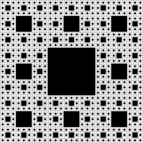

# 太极图形课S1-HW5

## 背景简介
我写了两段程序动画,第一个是视角持续拉进的谢尔宾斯基地毯,参考了Wikipedia.[wiki](https://zh.wikipedia.org/wiki/%E8%B0%A2%E5%B0%94%E5%AE%BE%E6%96%AF%E5%9F%BA%E5%9C%B0%E6%AF%AF)
第二个生成了一段弹幕动画.弹幕射击游戏经久不衰,比如东方Project.这些游戏的弹幕设计有一种朴素的绚丽,所以我尝试写了一个程序动画来生成弹幕,不过我的渲染方式效率并不高,因为我的代码里相当于每一个圆都需要遍历整个画布.
## 效果展示


## 运行环境
```
[Taichi] version 0.8.3, llvm 10.0.0, commit 021af5d2, linux, python 3.8.5
```
